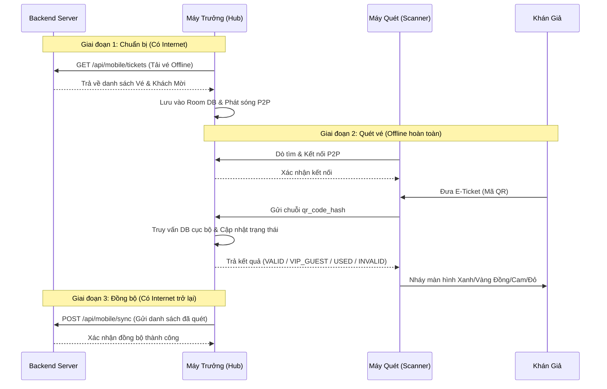

# Kiến Trúc Hệ Thống TicketBox Mobile (P2P Hub-Scanner)

## 1. Tổng quan Kiến trúc
Ứng dụng TicketBox Mobile được thiết kế chuyên biệt để hoạt động trong môi trường khắc nghiệt về mạng lưới viễn thông (sân vận động, sự kiện âm nhạc đông người,...). Thay vì mô hình Client-Server truyền thống (mọi máy đều phải có mạng để truy vấn Server), ứng dụng sử dụng mô hình **P2P Hub-Scanner** (Máy Trưởng - Máy Quét) để đảm bảo 100% tính khả dụng offline, tốc độ phản hồi < 0.5s và loại bỏ triệt để tình trạng lọt vé giả/vé trùng.

## 2. Các Thành phần trong Hệ thống

### 2.1. Backend Server (Node.js/Express & Postgres)
- **Nhiệm vụ:** Lưu trữ toàn bộ dữ liệu vé gốc, quản lý người dùng, cung cấp API tải dữ liệu và API đồng bộ cuối sự kiện.
- **Tương tác:** Chỉ giao tiếp với hệ thống cổng (Máy Trưởng) khi khu vực đó có mạng Internet.

### 2.2. Máy Trưởng - Hub (Local Server)
- **Nhiệm vụ:** Đóng vai trò là máy chủ trung tâm cục bộ tại một cụm cổng soát vé.
- **Công nghệ:** 
  - **Room Database (SQLite):** Lưu trữ hàng chục ngàn mã vé offline một cách an toàn và truy xuất tốc độ cao.
  - **Google Nearby Connections API:** Phát sóng mạng nội bộ (Advertising) tạo thành một mạng lưới P2P cục bộ.
- **Quy trình hoạt động:**
  - Tải dữ liệu từ Backend khi có mạng.
  - Lắng nghe và xử lý logic check-in từ các Máy Quét gửi về, khóa vé ngay trên DB nội bộ.
  - Đẩy dữ liệu (Sync) ngược lên Backend sau khi sự kiện kết thúc.

### 2.3. Máy Quét - Scanner (Dumb Client)
- **Nhiệm vụ:** Là thiết bị cầm tay nhỏ gọn do nhân viên cầm để soi mã QR của khán giả.
- **Công nghệ:**
  - **Google ML Kit:** Quét và giải mã QR cực nhanh, chính xác ngay cả trong điều kiện thiếu sáng.
  - **Google Nearby Connections API:** Dò tìm (Discovery) và duy trì kết nối liên tục với Máy Trưởng.
- **Đặc điểm:** Hoàn toàn "mù" dữ liệu. Không lưu trữ bất kỳ data nội bộ nào. Chỉ làm nhiệm vụ: Đọc QR -> Gửi Hash cho Máy Trưởng -> Nhận kết quả phản hồi -> Hiển thị UI.

## 3. Sơ đồ Luồng Dữ liệu (Data Flow)

## 4. Điểm mạnh vượt trội của Kiến trúc
1. **Zero-Latency Offline:** Không bị ảnh hưởng bởi độ trễ hay tắc nghẽn của mạng viễn thông.
2. **Single Source of Truth:** Máy Trưởng là điểm duy nhất quyết định trạng thái vé tại một cổng. Do đó, triệt tiêu được 100% rủi ro quét trùng vé (Double Entry) - ví dụ khán giả in vé làm 2 bản đưa cho 2 người xếp hàng.
3. **Khả năng phục hồi cao (Fault Tolerance):** 
   - Nếu Máy Quét rơi hỏng hoặc hết pin, chỉ cần lấy một điện thoại khác mở App kết nối lại vào Máy Trưởng là soát vé tiếp. Không hề mất mát dữ liệu.
   - Nếu Máy Trưởng sập nguồn, dữ liệu vẫn an toàn trên đĩa cứng (Room DB), khởi động lại là mạng lưới tiếp tục hoạt động.
