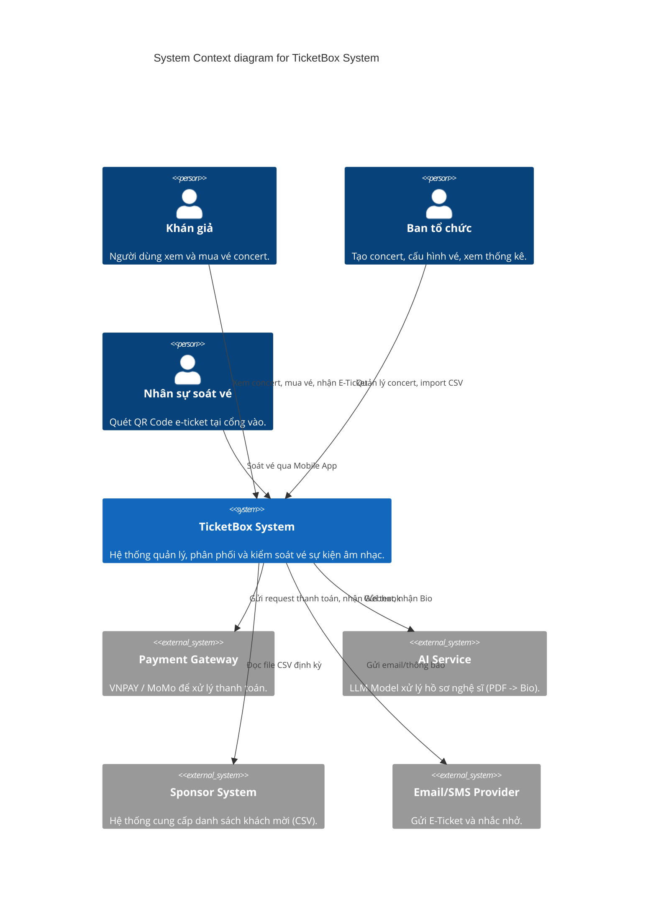
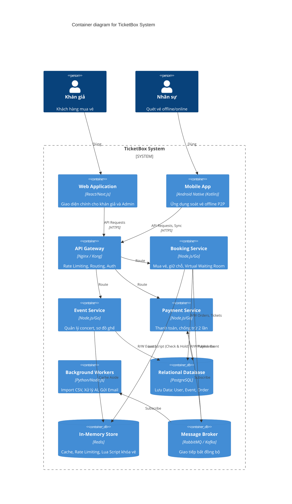
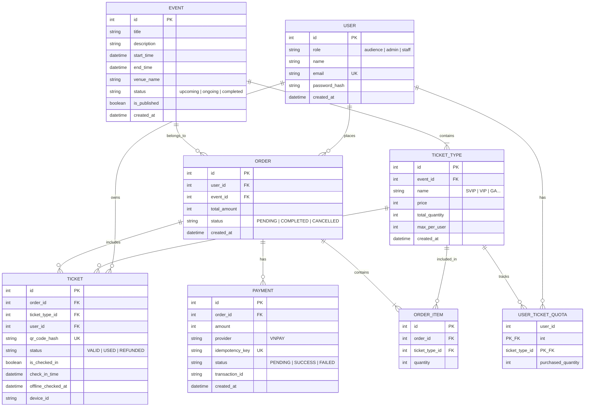

# TicketBox — Technical Design

Tài liệu này trình bày các quyết định thiết kế kiến trúc, công nghệ và cơ chế bảo vệ hệ thống cho dự án TicketBox. Ở mỗi vấn đề lớn, tài liệu đưa ra các phương án khả thi, phân tích đánh đổi (trade-offs) và đưa ra quyết định cuối cùng kèm lý do.

---

## 1. Kiến trúc tổng thể

### Các phương án thiết kế
*   **Phương án 1: Monolithic Architecture (Kiến trúc nguyên khối)**
    *   *Mô tả*: Toàn bộ backend (Booking, Event, Payment, Admin) nằm chung một source code và chạy trên cùng một tiến trình.
    *   *Trade-off*: Dễ phát triển, dễ deploy ban đầu. Tuy nhiên, khi luồng Booking chịu tải 80.000 users/5 phút, toàn bộ hệ thống (kể cả Admin hay Event) cũng sẽ bị ảnh hưởng hoặc sập theo. Khó scale độc lập từng thành phần.
*   **Phương án 2: Microservices Architecture (Kiến trúc vi dịch vụ)**
    *   *Mô tả*: Chia hệ thống thành các service độc lập: `API Gateway`, `Event Service`, `Booking Service`, `Payment Service`, `Worker Service`.
    *   *Trade-off*: Khả năng scale độc lập rất tốt (chỉ cần scale `Booking Service` khi mở bán vé). Rủi ro hệ thống thấp khi một service chết. Nhược điểm là phức tạp trong triển khai, cần quản lý giao tiếp mạng, data consistency (nhất quán dữ liệu) khó khăn hơn.
*   **Phương án 3: Modular Monolith**
    *   *Mô tả*: Source code vẫn nằm chung nhưng chia module rạch ròi.
    *   *Trade-off*: Dễ deploy hơn Microservices nhưng vẫn khó scale tài nguyên phần cứng cho luồng Booking một cách độc lập hoàn toàn.

### Chốt phương án: Microservices Architecture (Kết hợp Event-Driven)
*   **Lý do**: Đặc thù của hệ thống bán vé là tải không đồng đều, cực kỳ cao vào thời điểm mở bán và cực kỳ thấp ở thời điểm bình thường. Microservices cho phép scale-out mạnh mẽ `Booking Service` trong khung giờ vàng mà không lãng phí tài nguyên cho các service khác. Giao tiếp qua Message Queue (RabbitMQ) đảm bảo tính chịu lỗi cao.

---

## 2. C4 Diagram

### Level 1 — System Context

### Level 2 — Container

---

## 3. Thiết kế cơ sở dữ liệu

### 3.1. Các loại dữ liệu chính trong hệ thống
Hệ thống quản lý vé TicketBox xử lý nhiều nhóm dữ liệu với đặc thù truy xuất và yêu cầu ràng buộc khác nhau:
1.  **Dữ liệu định danh & phân quyền (Identity Data)**: Gồm thông tin người dùng (`User`), vai trò (`Role`), thông tin đăng nhập. Dữ liệu này yêu cầu tính bảo mật cao, ít thay đổi nhưng tần suất đọc lớn khi xác thực token.
2.  **Dữ liệu cấu hình & danh mục (Config/Master Data)**: Gồm thông tin sự kiện (`Event`), sơ đồ ghế, thông tin hạng vé (`TicketType`). Dữ liệu này hầu như chỉ đọc (Read-heavy) bởi khán giả và chỉ ghi/sửa (Write-rare) bởi Admin.
3.  **Dữ liệu giao dịch (Transactional Data)**: Gồm thông tin đơn hàng (`Order`), vé bán ra (`Ticket`), hóa đơn giao dịch (`Payment`). Đây là nhóm dữ liệu cốt lõi yêu cầu tính toàn vẹn tuyệt đối (ACID), không được phép xảy ra sai sót, mất mát hay xung đột trạng thái dữ liệu (ví dụ: một vé bị bán cho hai người).
4.  **Dữ liệu nóng, tạm thời & tốc độ cao (Hot/In-memory Data)**: Số lượng vé khả dụng còn lại trong kho (inventory), bộ đếm giới hạn tần suất gửi request (rate limit), thông tin kiểm tra trùng lặp giao dịch (Idempotency Key), và hàng đợi xếp hàng mua vé. Nhóm này yêu cầu tốc độ xử lý cực nhanh (dưới 5ms) và khả năng chịu tải hàng chục nghìn request đồng thời.

---

### 3.2. Đề xuất loại Database phù hợp

### Các phương án thiết kế
*   **Phương án 1: 100% Relational DB (PostgreSQL/MySQL)**
    *   *Trade-off*: Tính toàn vẹn (ACID) hoàn hảo, dễ join dữ liệu. Nhưng dưới tải hàng chục nghìn request, DB quan hệ dễ nghẽn (bottleneck) và bị lock table/row, gây chậm hệ thống.
*   **Phương án 2: 100% NoSQL (MongoDB)**
    *   *Trade-off*: Scale out ghi rất tốt, schema linh hoạt. Nhược điểm: thiếu ACID transaction cho nhiều document cùng lúc (dù MongoDB có hỗ trợ transaction nhưng overhead lớn), không tối ưu cho giao dịch tài chính chặt chẽ.
*   **Phương án 3: SQL (PostgreSQL) kết hợp Redis**
    *   *Trade-off*: PostgreSQL giữ nhiệm vụ lưu trữ vĩnh viễn và đảm bảo ACID cho Order/Payment. Redis đóng vai trò giảm tải đọc (caching) và xử lý tranh chấp vé siêu tốc trên RAM trước khi ghi vào SQL. Đòi hỏi quản lý tính nhất quán dữ liệu giữa Redis và SQL.

### Chốt phương án: Phương án 3 (PostgreSQL + Redis)
*   **Lý do**: Bài toán bán vé là bài toán "tranh chấp tài nguyên hữu hạn" với cường độ cao. Redis giải quyết hoàn hảo bài toán này bằng tốc độ của In-Memory và tính chất Single-threaded (bảo đảm thứ tự xử lý). PostgreSQL đứng sau làm kho lưu trữ an toàn (Source of Truth).

Hệ thống sử dụng mô hình **kết hợp (Hybrid Database Architecture)** giữa **CSDL quan hệ (SQL - PostgreSQL)** và **CSDL In-Memory (Redis)**:

| Tiêu chí | CSDL Quan hệ (PostgreSQL) | CSDL In-Memory (Redis) |
| :--- | :--- | :--- |
| **Vai trò** | Source of Truth (Kho lưu trữ bền vững) | Cản tải, xử lý đồng thời & Caching |
| **Đặc điểm dữ liệu** | Phức tạp, quan hệ chặt chẽ, cần ACID. | Đơn giản (Key-Value, Hash, Set), truy xuất nhanh. |
| **Lý do lựa chọn** | Đảm bảo an toàn tài chính, quản lý lịch sử đơn hàng của người dùng, mối liên kết chặt chẽ giữa Event - Ticket - User. | Tận dụng cơ chế đơn luồng (Single-threaded) và tốc độ ghi RAM để loại bỏ Race Condition khi khóa giữ vé (Check-and-Hold), lưu cache Idempotency Key và Rate Limiting. |

---

### 3.3. Sơ đồ thực thể mối quan hệ (ER Diagram)

---

### 3.4. Thiết kế chi tiết Schema (SQL & Redis)

#### A. Database Quan hệ (PostgreSQL)

##### Bảng `User` (Thông tin người dùng)
*   `id` (SERIAL, Primary Key): ID định danh tự động tăng.
*   `role` (VARCHAR(20), Default 'audience'): Phân quyền người dùng ('audience', 'admin', 'staff').
*   `name` (VARCHAR(100)): Họ và tên người dùng.
*   `email` (VARCHAR(150), Unique Index): Email đăng ký tài khoản.
*   `password_hash` (VARCHAR(255)): Mật khẩu đã được hash bằng bcrypt.
*   `created_at` (TIMESTAMP, Default NOW()): Thời gian khởi tạo tài khoản.

##### Bảng `Event` (Sự kiện/Concert)
*   `id` (SERIAL, Primary Key): ID định danh sự kiện.
*   `title` (VARCHAR(250)): Tên sự kiện (ví dụ: 'Anh Trai Say Hi').
*   `description` (TEXT): Mô tả chi tiết về sự kiện.
*   `start_time` (TIMESTAMP): Thời gian bắt đầu sự kiện.
*   `end_time` (TIMESTAMP): Thời gian kết thúc sự kiện.
*   `venue_name` (VARCHAR(200)): Địa điểm tổ chức.
*   `status` (VARCHAR(20), Default 'upcoming'): Trạng thái ('upcoming', 'ongoing', 'completed').
*   `is_published` (BOOLEAN, Default TRUE): Cho phép hiển thị public hay không.
*   `created_at` (TIMESTAMP, Default NOW()): Thời điểm tạo sự kiện.

##### Bảng `TicketType` (Hạng vé sự kiện)
*   `id` (SERIAL, Primary Key): ID định danh hạng vé.
*   `event_id` (INT, Foreign Key references `Event.id`): ID sự kiện chứa hạng vé này.
*   `name` (VARCHAR(50)): Tên hạng vé (ví dụ: 'SVIP', 'VIP', 'GA').
*   `price` (INT): Giá vé (đơn vị VND).
*   `total_quantity` (INT): Tổng số lượng vé phát hành tối đa cho hạng này.
*   `max_per_user` (INT, Default 2): Số lượng vé tối đa 1 user được phép mua.
*   `created_at` (TIMESTAMP, Default NOW()).

##### Bảng `Order` (Đơn hàng mua vé)
*   `id` (SERIAL, Primary Key): ID đơn hàng.
*   `user_id` (INT, Foreign Key references `User.id`): ID người đặt mua.
*   `event_id` (INT, Foreign Key references `Event.id`): ID sự kiện mua vé.
*   `total_amount` (INT): Tổng số tiền của đơn hàng.
*   `status` (VARCHAR(20), Default 'PENDING'): Trạng thái đơn hàng ('PENDING', 'COMPLETED', 'CANCELLED').
*   `created_at` (TIMESTAMP, Default NOW()): Thời điểm bắt đầu giữ vé (dùng để tính thời gian hết hạn 15 phút).

##### Bảng `OrderItem` (Chi tiết hạng vé trong đơn hàng)
*   `id` (SERIAL, Primary Key): ID chi tiết đơn hàng.
*   `order_id` (INT, Foreign Key references `Order.id`): Thuộc đơn hàng nào.
*   `ticket_type_id` (INT, Foreign Key references `TicketType.id`): Hạng vé nào.
*   `quantity` (INT): Số lượng vé mua của hạng vé này trong đơn.

##### Bảng `UserTicketQuota` (Chốt chặn giới hạn số lượng vé mua của user)
*   `user_id` (INT, Foreign Key references `User.id`): Người mua.
*   `ticket_type_id` (INT, Foreign Key references `TicketType.id`): Hạng vé.
*   `purchased_quantity` (INT, Default 0): Số lượng vé đã thanh toán thành công.
*   *Khóa chính*: Hỗn hợp (`user_id`, `ticket_type_id`).

##### Bảng `Ticket` (Vé điện tử cụ thể - sinh bất đồng bộ)
*   `id` (SERIAL, Primary Key): ID vé.
*   `order_id` (INT, Foreign Key references `Order.id`): Thuộc đơn hàng nào.
*   `ticket_type_id` (INT, Foreign Key references `TicketType.id`): Loại vé gì.
*   `user_id` (INT, Foreign Key references `User.id`): Người sở hữu vé hiện tại.
*   `qr_code_hash` (VARCHAR(100), Unique Index): Chuỗi băm ngẫu nhiên mã QR để in lên vé và quét soát vé.
*   `status` (VARCHAR(20), Default 'VALID'): Trạng thái ('VALID', 'USED', 'REFUNDED').
*   `is_checked_in` (BOOLEAN, Default FALSE): Trạng thái đã check-in qua cổng.
*   `check_in_time` (TIMESTAMP, NULL): Thời gian Server ghi nhận check-in trực tuyến.
*   `offline_checked_at` (TIMESTAMP, NULL): Thời gian thiết bị quét ghi nhận check-in thực tế ở cổng offline.
*   `device_id` (VARCHAR(100), NULL): Định danh của thiết bị máy quét thực hiện check-in.

##### Bảng `Payment` (Hóa đơn thanh toán)
*   `id` (SERIAL, Primary Key): ID giao dịch.
*   `order_id` (INT, Foreign Key references `Order.id`): ID đơn hàng cần thanh toán.
*   `amount` (INT): Số tiền cần thanh toán.
*   `provider` (VARCHAR(50), Default 'VNPAY'): Cổng thanh toán sử dụng.
*   `idempotency_key` (VARCHAR(100), Unique Index): Key chống trừ tiền 2 lần sinh ra từ Client.
*   `status` (VARCHAR(20), Default 'PENDING'): Trạng thái ('PENDING', 'SUCCESS', 'FAILED').
*   `transaction_id` (VARCHAR(150), NULL): Mã giao dịch trả về từ cổng thanh toán đối tác.
*   `created_at` (TIMESTAMP, Default NOW()).

---

#### B. Cấu trúc bộ nhớ đệm (Redis Key Schema)

Để hỗ trợ việc xử lý lượng truy cập cực lớn và các hoạt động thời gian thực đòi hỏi độ trễ cực thấp, hệ thống lưu các key có cấu trúc trên Redis như sau:

| Tên Key Redis | Loại dữ liệu | Mục đích | Thời gian sống (TTL) |
| :--- | :--- | :--- | :--- |
| `event:{event_id}:type:{ticket_type_id}:available` | **String** (Number) | Lưu trữ số vé còn lại khả dụng của hạng vé cụ thể phục vụ việc Check & Hold siêu tốc bằng Lua Script. | Vô hạn (hoặc cho tới khi sự kiện kết thúc). |
| `user:{user_id}:event:{event_id}:type:{ticket_type_id}:bought` | **String** (Number) | Lưu số lượng vé hạng này mà user cụ thể đã mua/đang giữ để kiểm tra quota limit. | Vô hạn (hoặc cập nhật lại khi hủy order quá hạn). |
| `payment:idem:{idempotency_key}` | **String** (URL) | Cache URL thanh toán VNPAY của hóa đơn tương ứng để trả lại ngay nếu người dùng click đúp hoặc mạng retry. | `3600` giây (1 giờ). |
| `rate_limit:{ip}` | **Hash** | Lưu trữ số lượng token còn lại và mốc thời gian Refill cuối cùng cho thuật toán Token Bucket. | `10` giây. |

---

## 4. Thiết kế các cơ chế bảo vệ hệ thống và giải quyết vấn đề kỹ thuật

### 4.1. Kiểm soát tải đột biến (Spike Load)
*   **Bài toán**: 80.000 người truy cập trong 5 phút, tập trung ở phút đầu.
*   **Các phương án**:
    1.  *Rate Limiting (Token Bucket)*: Chặn bớt request ở API Gateway. *Trade-off*: Dễ làm, nhưng khán giả thật bấm vào sẽ thấy báo lỗi liên tục, gây ức chế.
    2.  *Virtual Waiting Room (Phòng chờ ảo)*: Đưa request mua vé vào hàng đợi, người dùng nhận số thứ tự và poll trạng thái. *Trade-off*: Trải nghiệm tốt, công bằng (First Come First Serve), backend không bao giờ sập do được consume request theo tốc độ kiểm soát được. Code phức tạp hơn.
    3.  *Auto-scaling cực mạnh*: Scale up server liên tục. *Trade-off*: Đắt đỏ, DB vẫn có nguy cơ chết, và không thể scale tức thì trong 1 phút đầu.
*   **Chốt phương án**: **Virtual Waiting Room kết hợp Token Bucket**.
    *   *Lý do*: API Gateway dùng Token Bucket để cản bot spam (ví dụ >10 req/s/IP). Khán giả vào mua vé được đưa vào Virtual Waiting Room (sử dụng Redis Queue hoặc RabbitMQ) để xử lý tuần tự, đảm bảo công bằng, trải nghiệm UI rõ ràng (hiển thị "Bạn đang đứng thứ X trong hàng đợi") và bảo vệ DB 100%.

### 4.2. Tranh chấp vé và Giới hạn Per-User (Concurrency Control)
*   **Bài toán**: 200 vé SVIP bị hàng nghìn người tranh mua cùng lúc; giới hạn max vé/người.
*   **Các phương án**:
    1.  *Pessimistic Locking (SQL SELECT FOR UPDATE)*: *Trade-off*: An toàn nhưng lock row, gây nghẽn toàn bộ DB dưới tải cao.
    2.  *Optimistic Locking (Version Column)*: *Trade-off*: Dễ conflict, request bị fail nhiều, user phải bấm lại.
    3.  *Redis Lua Script (Atomic Operations)*: Đưa logic kiểm tra số lượng vé còn lại và kiểm tra quota của user vào 1 script Lua chạy trên Redis. *Trade-off*: Cực kỳ nhanh, không bị Race Condition do Redis chạy single-thread.
*   **Chốt phương án**: **Redis Lua Script**.
    *   *Lý do*: Đáp ứng cả tốc độ lẫn tính chính xác. Script kiểm tra `quota user` và `inventory`, nếu đủ sẽ trừ luôn trên RAM (Redis) rồi mới đẩy message (qua MQ) để Worker tạo Order trong SQL (Eventual Consistency).

### 4.3. Chống trừ tiền hai lần (Double Charge Prevention)
*   **Bài toán**: Khán giả bấm mua 2 lần hoặc mạng đứt khi đang gọi cổng thanh toán.
*   **Các phương án**:
    1.  *Chỉ dựa vào Transaction ID của VNPAY/MoMo*: *Trade-off*: Nếu request chưa sang được VNPAY đã rớt mạng, client gửi lại sẽ sinh giao dịch mới.
    2.  *Idempotency Key*: Frontend sinh ra 1 UUID (Idempotency Key) cho mỗi lần bấm "Thanh toán". Backend nhận key, lưu vào Redis. Nếu request đến mang key đã tồn tại và xử lý thành công, trả về kết quả cũ.
*   **Chốt phương án**: **Idempotency Key**.
    *   *Lý do*: Chuẩn công nghiệp cho các hệ thống payment, ngăn ngừa hoàn toàn rủi ro retry từ mạng lưới hoặc lỗi UX (user double click). Key được cache trên Redis với TTL 24h và persist xuống bảng `Payments` trong DB.

### 4.4. Xử lý cổng thanh toán không ổn định
*   **Bài toán**: VNPAY/MoMo timeout kéo dài.
*   **Các phương án**:
    1.  *Retry cơ học*: *Trade-off*: Làm treo thêm tài nguyên backend của TicketBox (cạn kiệt connection pool).
    2.  *Circuit Breaker Pattern*: Theo dõi tỷ lệ lỗi. *Trade-off*: Cần cơ chế theo dõi và fallback.
*   **Chốt phương án**: **Circuit Breaker Pattern**.
    *   *Lý do*: Tránh "hiệu ứng tuyết lở" (cascading failure). Nếu cổng thanh toán sập, Circuit Breaker ngắt mạch (Open state), API trả về ngay "Hệ thống thanh toán bảo trì". Luồng xem concert và mua vé giữ chỗ (không thanh toán ngay) vẫn hoạt động bình thường (Graceful Degradation).

### 4.5. Caching chiến lược
*   **Bài toán**: Trang danh sách và chi tiết concert quá tải nhưng ít thay đổi; số vé thì thay đổi liên tục.
*   **Các phương án**:
    1.  *Không dùng cache*: DB sập ngay lập tức.
    2.  *Cache toàn bộ (TTL cố định)*: *Trade-off*: Nhanh nhưng số lượng vé bị stale (trễ), user thấy còn vé, click vào báo hết (Bad UX).
    3.  *Cache-Aside + Chủ động cập nhật Hash*: Tách riêng thông tin tĩnh (tên, mô tả) và số lượng vé còn.
*   **Chốt phương án**: **Cache-Aside tách biệt Dữ liệu tĩnh và Động**.
    *   *Lý do*: 
        *   Thông tin tĩnh (Tên, mô tả, hình ảnh): Cache Redis dạng String/JSON, TTL dài, xóa cache khi Admin sửa.
        *   Số lượng vé: Lưu trong Redis Hash (`event:{id}:tickets`). Trả về kèm theo API chi tiết. Dữ liệu này luôn chuẩn xác theo thời gian thực nhờ Lua Script trừ trực tiếp.

### 4.6. Soát vé tại sự kiện (Offline Check-in)
*   **Bài toán**: Tại sân vận động mạng 3G/4G chập chờn hoặc mất hẳn, không thể gọi API real-time lên Server, nhưng hệ thống phải chống lọt vé giả và tuyệt đối ngăn chặn 1 vé lách qua 2 cổng khác nhau.
*   **Các phương án**:
    1.  *Chỉ Online*: Thiết bị quét gọi API trực tiếp. *Trade-off*: Phụ thuộc 100% vào hạ tầng mạng sự kiện, nguy cơ gián đoạn soát vé dẫn đến vỡ trận ở cổng vào.
    2.  *Đồng bộ phân tán (Mỗi máy tự lưu Database riêng)*: Mỗi máy quét tải toàn bộ Database về local. *Trade-off*: Tốc độ siêu nhanh, nhưng nếu mất mạng hoàn toàn, 1 người chụp màn hình vé gửi cho bạn bè đứng ở cổng khác thì cả 2 đều lọt (vì 2 máy quét không giao tiếp được với nhau).
    3.  *Kiến trúc Hub-Spoke P2P (Máy Trưởng - Máy Quét)*: Một "Máy Trưởng" (Hub) tải Database hợp lệ về, các "Máy Quét" (Scanner) xung quanh kết nối trực tiếp với Hub qua mạng nội bộ (Wi-Fi Direct/Bluetooth).
*   **Chốt phương án**: **Kiến trúc Hub-Spoke P2P (Máy Trưởng - Máy Quét) sử dụng Google Nearby Connections**.
    *   *Lý do*: Xử lý triệt để bài toán "Double Check-in" (quét 2 lần) khi mất mạng Internet.
    *   *Cơ chế hoạt động*: Máy Trưởng là "Single Source of Truth" duy nhất tại hiện trường. Nó lưu trữ Room Database tải từ Server về trước sự kiện. Các Máy Quét chỉ làm nhiệm vụ duy nhất là dùng Camera phân tích mã QR, sau đó truyền mã đó tới Hub qua mạng ngang hàng P2P không cần Internet. Hub kiểm tra, cập nhật trạng thái vé và trả kết quả về cho Scanner hiển thị Xanh/Đỏ. Do mọi truy vấn đều dồn về một Database Hub duy nhất, dù cắt mạng 100%, 1 vé không bao giờ đi qua được 2 cửa. Sau khi xong việc, chỉ Máy Trưởng cần cắm mạng để đồng bộ (Sync) dữ liệu Check-in ngược lên Backend.

### 4.7. Môi trường hoạt động của Ứng dụng Soát vé (Staff App)
*   **Bài toán**: Nhân sự soát vé cần thiết bị ổn định, tốc độ phản hồi nhanh và khả năng chạy offline P2P không bị ngắt quãng.
*   **Các phương án**:
    1.  *Cross-platform (iOS & Android) / BYOD (Bring Your Own Device)*: Cho phép nhân viên dùng điện thoại cá nhân, code bằng React Native/Flutter. *Trade-off*: Rủi ro vận hành rất lớn (hết pin, camera mờ, tin nhắn rác chen ngang lúc đang quét). Kỹ thuật phức tạp do iOS cực kỳ khắt khe với tác vụ chạy ngầm, thường tự động ngắt kết nối Wi-Fi Local/Bluetooth để tiết kiệm pin khiến hệ thống soát vé offline bị đứt gãy giữa chừng.
    2.  *Android Native độc quyền*: Ban tổ chức thuê hoặc mua lô thiết bị Android (PDA chuyên dụng hoặc dòng máy giá rẻ). *Trade-off*: Tốn chi phí cấp phát phần cứng nhưng kiểm soát được 100% sự cố.
*   **Chốt phương án**: **Phát triển Native độc quyền trên Android**.
    *   *Lý do Kỹ thuật*: Hệ điều hành Android hỗ trợ chuẩn Wi-Fi Direct mở, cho phép thiết lập mạng LAN ảo ngang hàng (P2P Mesh) bằng Google Nearby Connections cực kỳ ổn định. Nó không tự động kill các kết nối ngầm (background kill) như iOS. Việc phát triển thuần Native (Kotlin, Jetpack Compose) giúp tận dụng tối đa sức mạnh phần cứng, tối ưu hiệu năng CameraX và truy xuất Room Database (SQLite) tốc độ siêu tốc.
    *   *Lý do Vận hành (Business)*: Các sự kiện lớn không bao giờ dùng chính sách BYOD. Ban tổ chức luôn cấp phát thiết bị Android được sạc đầy và khóa trong chế độ Kiosk Mode (chỉ hiển thị đúng app TicketBox, không thể thoát ra). Việc tập trung viết app Android Native giúp tiết kiệm 50% chi phí R&D, giảm rủi ro tương thích và phù hợp 100% với thực tiễn ngành tổ chức sự kiện.

### 4.8. Đồng bộ danh sách khách mời (Sponsor CSV)
*   **Bài toán**: Hệ thống nhãn hàng ném file CSV lúc nửa đêm, không gọi API.
*   **Các phương án**:
    1.  *API upload thủ công*: Admin phải dậy lúc nửa đêm tải file. *Trade-off*: Bất tiện.
    2.  *Cronjob định kỳ quét thư mục/SFTP/Cloud Storage*: *Trade-off*: Phải quản lý trạng thái file (đã đọc/chưa đọc/lỗi).
*   **Chốt phương án**: **Worker định kỳ đọc file (Cronjob + Status Tracking)**.
    *   *Lý do*: Hệ thống tự động pull file CSV. Worker chạy nền (không ảnh hưởng luồng chính), validate dữ liệu. Lưu kết quả xử lý (dòng nào lỗi, trùng lặp) để admin review vào sáng hôm sau. Upsert dữ liệu vào DB (Update nếu trùng ID, Insert nếu mới). Tự động bỏ qua lỗi từng dòng để không gián đoạn toàn batch.

---

## 5. Tổng kết
Hệ thống áp dụng kiến trúc Microservices phân mảnh, dùng Redis làm mũi nhọn hứng chịu tải và đồng bộ trạng thái (Lua Script, Queue, Circuit Breaker). PostgreSQL là kho lưu trữ bền vững. Mô hình này đáp ứng tốt tính công bằng, chịu tải cao của các sự kiện hàng chục ngàn người, và giữ trải nghiệm người dùng tốt khi có lỗi mạng hay cổng thanh toán.
